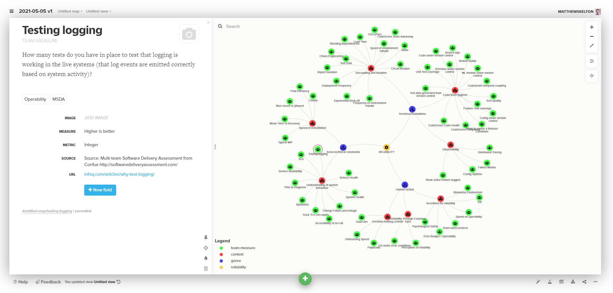

# Software Reliability Model - reliability-model

This Software Reliability Model (SRM) provides a flexible and explainable model of software reliability in terms of technical foundations, socio-technical constraints, and human factors. It is designed to help explore and explain software reliability to people of various roles who are involved in building and running software systems (especially when on-boarding new team members), and track progress in improving reliability. The SRM is also designed to make it easy to generate and update hierarchical metrics for product health scores across multiple teams.

The software reliability model is designed to be relevant to several different kinds of software systems:

* internet and cloud-based software
* desktop software
* IoT and embedded software
* (combinations of the above)

The different team measures, context, and genres of influences are linked to create a graph that helps to explain the dynamics around software reliability. The graph is then visualised using the visualisation tool [Kumu](https://kumu.io/).

## Who created the Software Reliability Model?

This software reliability model was co-created by people from [TELUS Digital](https://www.telus.com/en/digital) ([@telus](https://github.com/telus)) and [Conflux](http://confluxhq.net/) ([@ConfluxHQ](https://github.com/ConfluxHQ)), with significant contributions from:

* [Bojan Savic](https://github.com/savicbo) of TELUS Digital
* [Matthew Skelton](https://github.com/matthewskelton) of Conflux

## Audience

The SRM is aimed at these kinds of people:

* Product Owner / Product Manager
* [SRE](https://sre.google/) Manager / [SRE](https://sre.google/) Lead
* Software Architect / Systems Architect / Test Architect
* Software Developer
* Software Tester

The SRM helps these people to explore and discuss different aspects of software reliability to help make targeted improvements.

## What's in the SRM?

The SRM is composed of 2 main parts:

1. definitions of reliability factors in CSV format suitable for import to [Kumu](https://kumu.io/) 📄
2. graphs in [Kumu](https://kumu.io/) generated by importing the CSV definitions 📊

The CSV files (and visualisation settings) are imported into Kumu to generate explorable graphs.

# How to use the reliability model

There are several ways to use the SRM. Here are some suggestions:

1. **Freeform exploration**: use the Kumu graphs to investigate different aspects of reliability in a free-form way.
1. **Guided Workshops**: use the _context_ groupings to do a deep dive into specific aspects of reliability. For example, run a 90-minute workshop on _Decoupling and isolation_ or _Speed of remeditation_. Use the workshop to get a sense of awareness within the team of the team-level practices and measures that sit under that _context_ parent node. Then repeat the workshop but with a new _context_.
1. **Metrics roll-up**: use the SRM to score teams on their current reliability practices and status. The _Metric_ and _Measure_ details for each leaf node provide details of what to measure and the type of measurement. Aggregate the measures into the parent nodes until you have a single score for Reliability for that team.
1. **All 3 of the above**: use all three above approaches for maximum benefit, helping the team members to understand how they can help to improve reliability on a daily basis.

# Explore the latest version of the model on Kumu

Visit the latest stable version of the reliability model on Kumu: [https://kumu.io/reliability-model/latest](https://kumu.io/reliability-model/latest)

See all versions of the model: [https://kumu.io/reliability-model](https://kumu.io/reliability-model)

# Types of factors in the model

There are several types of factors in the SRM - each factor type is shown differently in the Kumu graph:

* team measure - team-level measures that influence reliability
* context - the context in which measures are taken
* genre - the high-level grouping of measures
* reliability - the ultimate goal of all these factors

## Tags to help explore the model

Tags are used to explore different dimensions of the model:

* 4 Key Metrics - from the book [_Accelerate_](https://itrevolution.com/book/accelerate/):
  - lead time
  - deployment frequency
  - Mean Time To Restore (MTTR)
  - Change failure rate
* CodeScene - measures from the tool CodeScene (see [CodeScene.io](https://codescene.io/))
* Continuous Delivery - measures from the Continuous Delivery dimension of MSDA
* Deployment - measures from the Deployment dimension of MSDA
* Deployment technique - techniques for reliability focused on deployment aspects
* Flow - measures from the Flow dimension of MSDA
* Human technique - techniques for reliability focused on human aspects
* MSDA - measures from [Multi-team Software Delivery Assessment (MSDA)](http://softwaredeliveryassessment.com/)
* On-call - measures from the On-call dimension of MSDA
* Operability - measures from the OPerability dimension of MSDA
* RTCE - measures from the [Reliability Through Customer Eyes (RTCE)](http://rtce.net/) principles devised by TELUS and Conflux.
* Reliability and SRE - measures from the Reliability dimension of MSDA
* Runtime technique - techniques for reliability focused on runtime aspects
* Team Health - measures from the Team Health dimension of MSDA
* Team Topologies - measures derived from the book [Team Topologies](https://teamtopologies.com/)
* Team API - measures relating to the 'Team API' concept in Team Topologies
* Team Autonomy - measures relating to team autonomy as discussed in Team Topologies
* Team Cognitive Load - measures relating to the 'Team Cognitive Load' concept in Team Topologies
* Testability - measures from the Testability dimension of MSDA
* UX - measures relating to end-user experience
* Version Control Hygiene - measures relating to good version control practices

# Notes on the model and visualization

1. Names of Kumu element types, connection types, and tags are ["selector friendly" for the Kumu advanced editor](https://docs.kumu.io/guides/import.html#try-to-be-selector-friendly) - a single word.
1. The graph layout visualization is controlled by the settings in the `*.css` view files (imported into the [Advanced Editor](https://docs.kumu.io/overview/view-editors.html#advanced-editor) settings in Kumu).
1. The CSV data import in Kumu needs some attention to detail. Be sure to follow the [CSV import details](https://docs.kumu.io/guides/import.html).

# Books that influenced the model

These books influenced the reliability model significantly:

* [_Accelerate_](https://wordery.com/accelerate-nicole-forsgren-phd-9781942788331) by Nicole Forsgren, Jez Humble, and Gene Kim
* [_Agile Testing_](https://wordery.com/agile-testing-lisa-crispin-9780321534460) by Lisa Crispin and Janet Gregory
* [_Continuous Delivery_](http://continuousdelivery.com/) by Jez Humble and Dave Farley
* [_Growing Object-Oriented Software_](https://wordery.com/growing-object-oriented-software-guided-by-tests-steve-freeman-9780321503626) by Steve Freeman and Nat Price
* [_Principles of Product Development Flow_](https://wordery.com/the-principles-of-product-development-flow-donald-g-reinertsen-9781935401001) by Don Reinertsen
* [_Seeking SRE_](https://www.oreilly.com/library/view/seeking-sre/9781491978856/) edited by David N. Blank-Edelman
* [_Site Reliability Engineering_](https://sre.google/sre-book/table-of-contents/) by Betsy Beyer, Chris Jones, Jennifer Petoff, & Niall Murphy
* [_Team Guide to Metrics for Business Decisions_](http://bizmetricsbook.com/) by Mattia Battiston and Chris Young
* [_Team Guide to Software Operability_](http://operabilitybook.com/) by Matthew Skelton, Alex Moore, & Rob Thatcher
* [_Team Guide to Software Testability_](http://testabilitybook.com/) by Ash Winter and Rob Meaney and the companion website [TestabilityQuestions.com](http://TestabilityQuestions.com/)
* [_The Site Reliability Workbook_](https://sre.google/workbook/table-of-contents/) edited by Betsy Beyer, Niall Richard Murphy, David K. Rensin, Kent Kawahara, & Stephen Thorne
* [_Working Effectively with Legacy Code_](https://www.amazon.co.uk/Working-Effectively-Legacy-Michael-Feathers/dp/0131177052) by Michael Feathers

# Possible improvements

* Use CI to test Pull Requests against Kumu import:
  - Duplicate nodes?
  - Dangling connectors?
